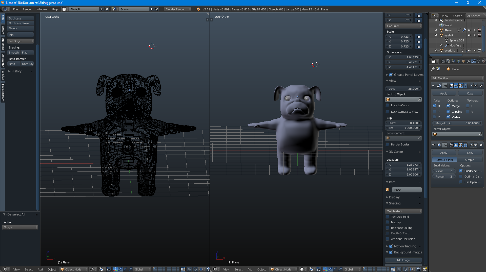
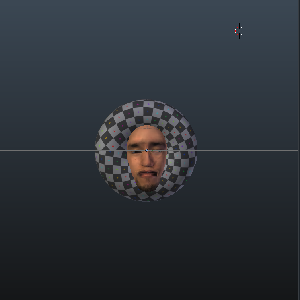
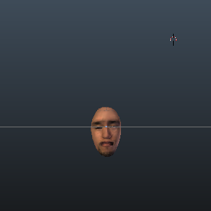

# Learning and Using Blender

  
  
  

## Modeling and Texturing

In an effort to further my studies over a summer break I took interest in learning how to use the Blender software. My
intention was to build a small arcade-style game so that I could practice and learn game design, as well as learn how
to use and manipulate 3D models in a game engine such as Unity. The project for that untitled unity game  was unfinished
and unfortunately lost when an old harddrive of mine failed.

With this project I learned how to properly sculpt an object using a front and side profile of an image as a reference.
I learned how to properly manipulate the program to the point where I achieved a model that matched what I was aiming
for. Due to the harddrive crash I was only able to learn as far as texturing a model and was not able to
rig or import the model into unity as I had originally intended. In the related Unity project I only had simple physics
for walking and jumping, as well as interacting with objects. I was using a default cube as the temporary model, which is
what the pug image above was intended to replace.

## How do I intend to use this moving forward?
I really enjoyed undertaking this project as it allowed me to express my artistic creativity while simultaneously 
learning technical aspects about 3D animation and modeling. My future intentions with blender and 3D modeling in
general is to be able to properly rig a 3D model and import the project into Unity to complete my initial task when
I started the project. I only intend to pursue 3D modeling as a hobby at the moment, as I see it secondary to my other
interest of game design, but I do intend to further my knowledge in the area.
